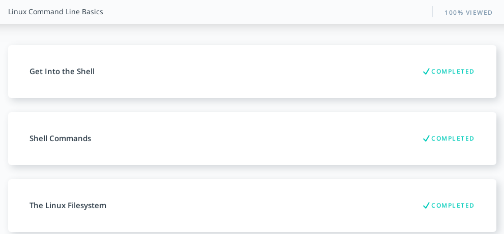
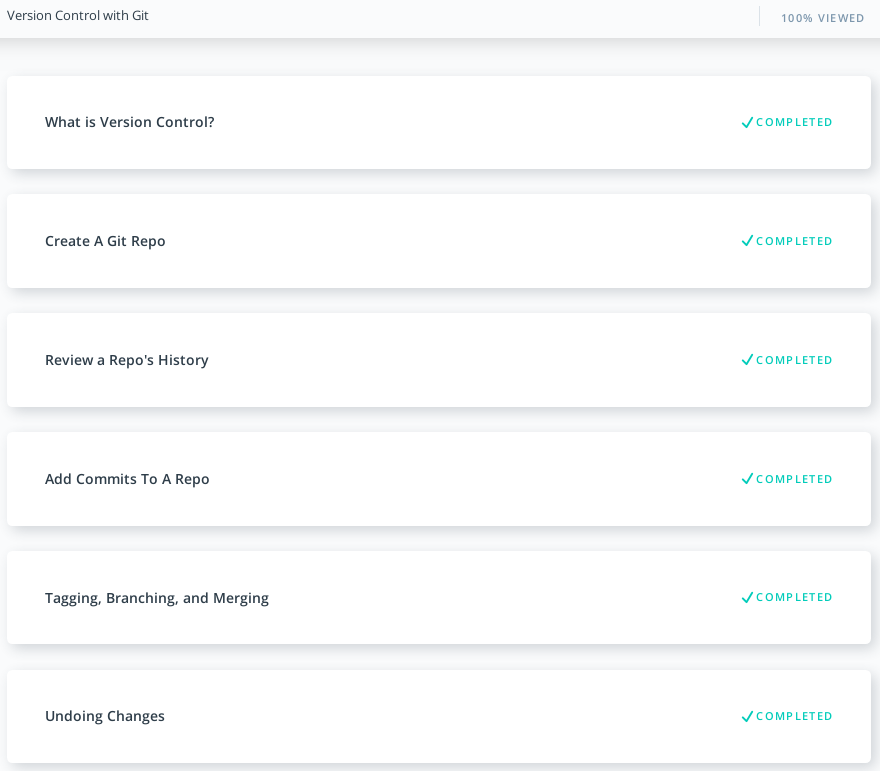
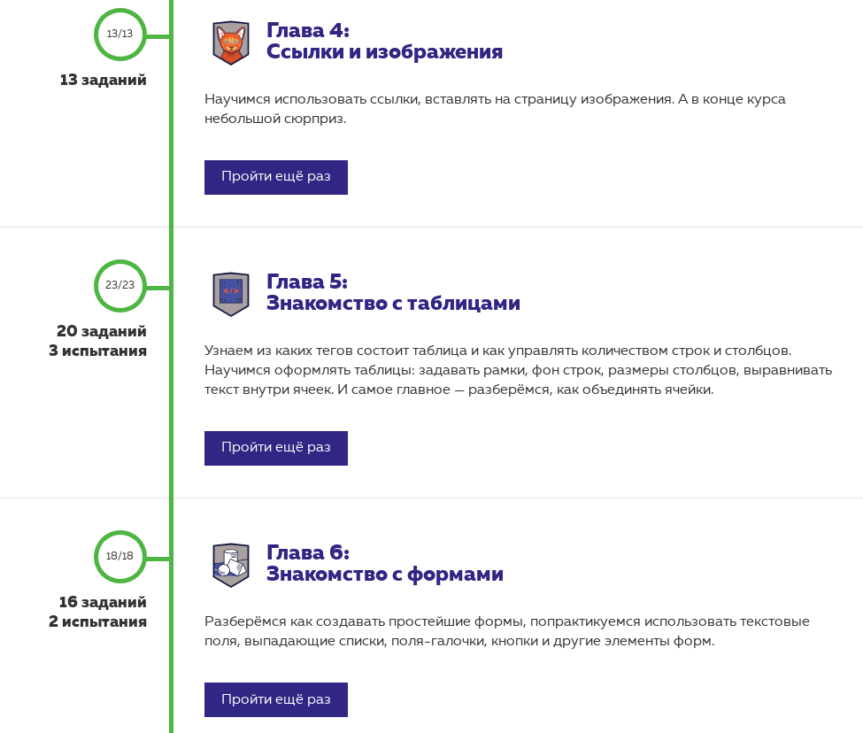
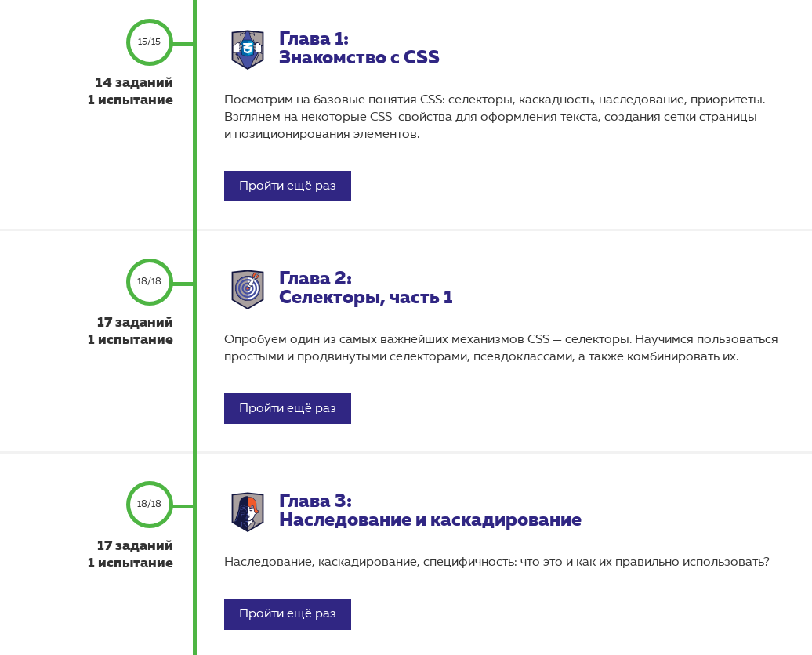

# kottans-frontend
Wow... :feet: [course](https://github.com/kottans/frontend) :+1:
> Programming - it's difficult and interesting simultaneously. For learning you must be self-organized and getting a good materials. I'm pleasantly impressed with the structure of tasks.
### Reflections
> In [front-end dictionary](https://github.com/web-standards-ru/dictionary/blob/master/dictionary.md) i found phrases/terminology/technnologies which new for me. Some of them was surprised me and i have intent use it in my future working. In fact, the following list is short of all results. I chose the main of them.

**New for me:**
1. Classitis
2. Divitis
3. Graceful degradation
4. 9-slice scaling
5. Interoperability

**Interesting to try:**
1. Continuous integration
2. Progressive Web App, PWA

## Git and GitHub
> Thanks to the completed tasks, i reminded basic concepts of working with git. Almost overcome fear of commits and public code :grimacing:.
## Linux CLI, and HTTP
1. [x] Udacity [Linux Command Line Basics](https://www.udacity.com/course/linux-command-line-basics--ud595)

2. [x] Codecademy [Learn the Command Line](https://www.codecademy.com/learn/learn-the-command-line)

> Linux commands didn't new for me.
## Git Collaboration
1. [x] Udacity [Version Control with Git](https://classroom.udacity.com/courses/ud123/)

2. [x] Udacity [GitHub & Collaboration](https://classroom.udacity.com/courses/ud456)

> New for me was functions and they parameters that allows you to modify or revert commits. Also i wrote useful commands.
### Tooltips:
```
git commit --amend
git revert <SHA-of-commit-to-revert>
git reset <reference-to-commit>
git log [<options>]
    -p
    --stat
    --decorate
    --author="..."
    --grep="..."
    --pretty=format:"..."
git branch [<options>]
    --merged
    --no-merged
git shortlog [<options>]
    -s
    -n
```
## Intro to HTML and CSS
1. [x] Udacity [Intro to HTML & CSS](https://www.udacity.com/course/intro-to-html-and-css--ud001)

2. [x] HTML Academy

* [Basics of HTML](https://htmlacademy.ru/courses/4/)


* [Basics of CSS](https://htmlacademy.ru/courses/41)
