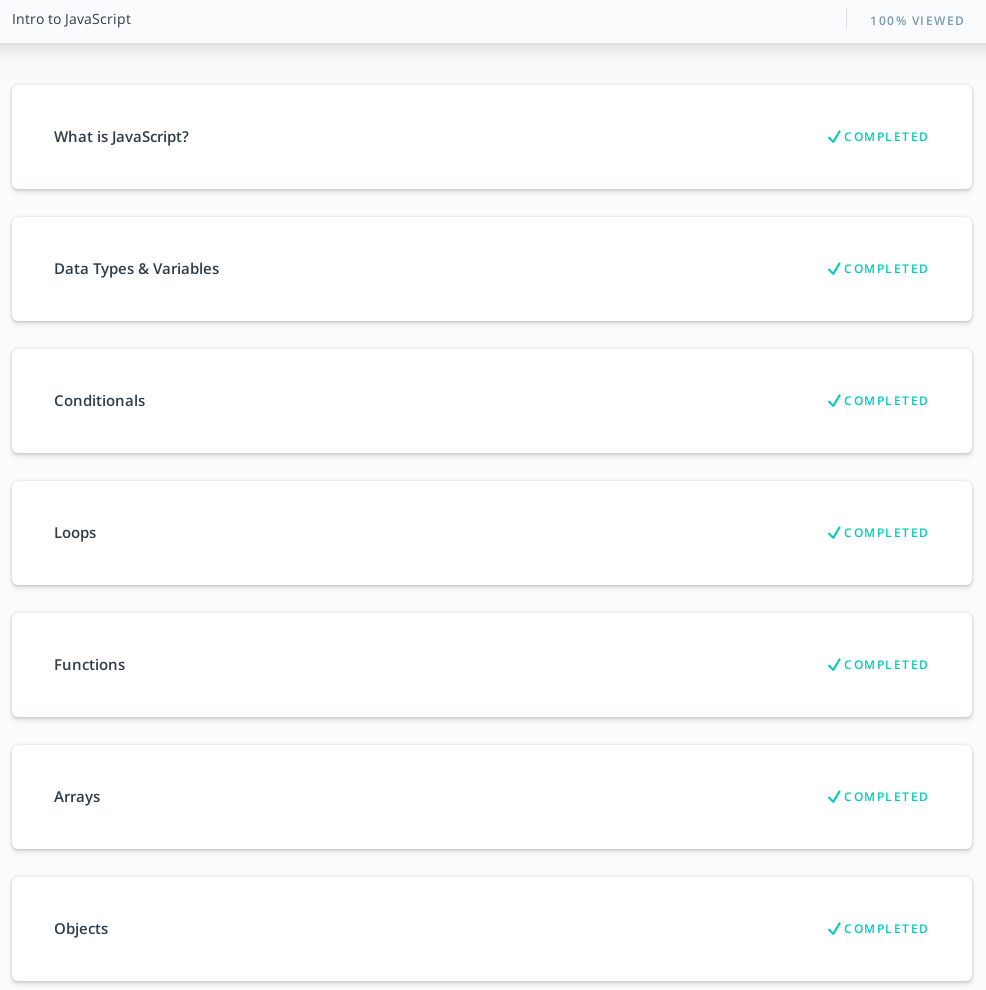
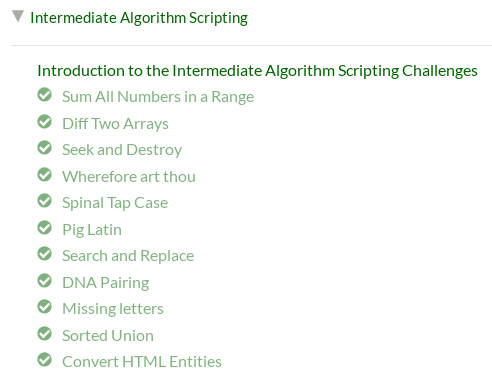

## JS Basics

- [x] Udacity [Intro to JS](https://www.udacity.com/course/intro-to-javascript--ud803)

- [x] freeCodeCamp [Algorithm Scripting Challenges](https://learn.freecodecamp.org/javascript-algorithms-and-data-structures/intermediate-algorithm-scripting/)

[back](../README.md)